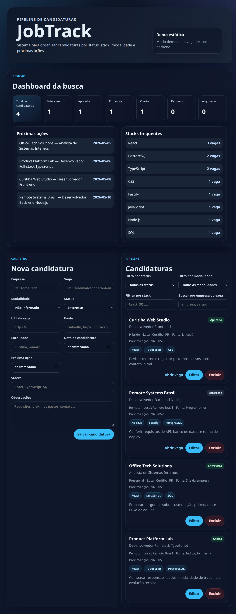

# JobTrack

Sistema full-stack para organizar candidaturas, acompanhar status, stack, modalidade de trabalho e próximas ações.

## Demo

Demo pública: https://mestrey0d4-uninter.github.io/jobtrack/



A demo roda no navegador com dados de exemplo. Para persistência real, rode a API e o PostgreSQL localmente.

## O que o sistema faz

- Cadastro, edição, listagem e exclusão de candidaturas.
- Status do processo: `interested`, `applied`, `interview`, `offer`, `rejected` e `archived`.
- Filtros por status, modalidade, stack e texto.
- Campo de próxima ação para follow-up.
- Dashboard com total por status, próximas ações e stacks frequentes.
- Modo demo front-only para avaliação rápida sem banco de dados.

## Stack

- React + TypeScript + Vite
- Node.js + TypeScript + Fastify
- PostgreSQL + Prisma
- Zod
- Vitest
- GitHub Actions

## Documentação técnica

- [Requisitos do produto](docs/product-requirements.md)
- [Plano de implementação](docs/plans/implementation-plan.md)
- [Visão técnica](docs/case-study.md)
- [ADR-001 — Full-stack TypeScript](docs/adrs/ADR-001-fullstack-typescript.md)
- [ADR-002 — PostgreSQL + Prisma](docs/adrs/ADR-002-postgresql-prisma.md)
- [ADR-003 — Estratégia de testes](docs/adrs/ADR-003-testing-strategy.md)
- [ADR-004 — Uso responsável de IA](docs/adrs/ADR-004-ai-usage-policy.md)

## Segurança e privacidade

A demo usa dados de exemplo. Não insira dados pessoais ou sensíveis em ambiente público.

Secrets e connection strings reais devem ficar em `.env`, nunca no repositório. O projeto mantém `.env.example` apenas com valores de desenvolvimento local.

## Como rodar a demo local

Para visualizar o front com dados de exemplo, sem API, PostgreSQL ou `.env` real:

```bash
npm install
VITE_DEMO_MODE=true npm run dev -w apps/web
```

Depois acesse `http://localhost:5173`.

Para gerar o build estático da demo:

```bash
VITE_DEMO_MODE=true npm run build -w apps/web
cd apps/web/dist
python3 -m http.server 5173
```

## Como rodar com API e banco

```bash
npm install
cp .env.example .env
npm run db:up
npm run db:generate
npm run db:deploy -w apps/api
npm run db:seed -w apps/api
```

A API usa `DATABASE_URL` definida no `.env`. O PostgreSQL local fica em `localhost:5433` para evitar conflito com instalações na porta padrão `5432`.

Em dois terminais:

```bash
npm run dev -w apps/api
npm run dev -w apps/web
```

Acesse `http://localhost:5173`.

O Vite usa proxy de `/api` para `http://localhost:3333`. Se a API estiver em outro endereço, ajuste `VITE_API_BASE_URL` no `.env`.

## API

Com o servidor rodando, a API expõe:

- `GET /health`
- `POST /applications`
- `GET /applications?status=&workMode=&stack=&search=`
- `GET /applications/:id`
- `PATCH /applications/:id`
- `DELETE /applications/:id`
- `GET /dashboard/summary?today=YYYY-MM-DD`

Payloads de criação e edição são validados com Zod. `DELETE` remove a candidatura; para ocultar sem apagar, use `PATCH` alterando `status` para `archived`.

## Validação

Para rodar a validação completa, crie o `.env` local a partir do exemplo e suba o PostgreSQL antes dos testes de integração:

```bash
test -f .env || cp .env.example .env
npm run db:up
npm run db:generate
npm run db:deploy -w apps/api
npm run typecheck
npm test
npm run test:integration
npm run build
```

## Próximos passos

- Adicionar importação/exportação CSV.
- Melhorar filtros salvos e ordenação.
- Avaliar autenticação para uso privado.
- Avaliar visualização Kanban sem complicar o fluxo principal.

## Licença

MIT. Veja [LICENSE](LICENSE).
