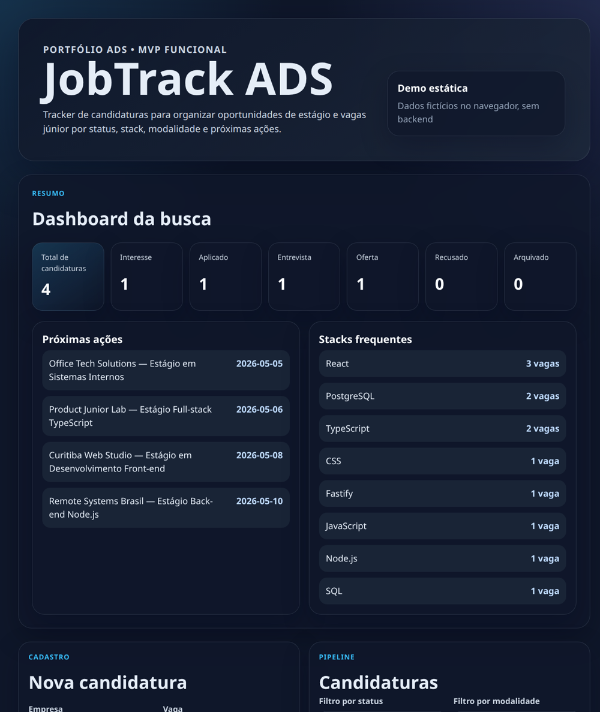

# JobTrack ADS

Tracker de candidaturas para estudantes de ADS/TI organizarem oportunidades de estágio/júnior por status, stack, modalidade e próximas ações.

Status: Milestones 0–6 concluídos e demo estática local disponível. A base técnica, validação de domínio, filtros, dashboard, PostgreSQL/Prisma, migration inicial, seed fictício, repository, rotas REST CRUD, front-end MVP integrado à API e modo demo com dados fictícios já estão implementados e testados.

## Preview da demo



A imagem acima mostra a demo estática com dados fictícios rodando só no navegador, sem backend nem banco. A captura full-page também está versionada em `docs/assets/jobtrack-ads-demo-dashboard.png`.

## Por que este projeto existe

Durante a busca por estágio, é fácil perder links, datas, requisitos e status das candidaturas. O JobTrack ADS organiza a busca como um pipeline simples e mostra métricas úteis sem depender de planilhas bagunçadas.

## MVP planejado

- Criar, listar, editar e excluir candidaturas.
- Atualizar status: `interested`, `applied`, `interview`, `offer`, `rejected`, `archived`.
- Filtrar por status, modalidade, stack e texto.
- Acompanhar próxima ação/follow-up.
- Dashboard com contagem por status, próximas ações e stacks frequentes.
- Seed com dados fictícios para demonstração.

## Estado atual

Implementado até agora:
- API Fastify com `GET /health`.
- Schemas Zod para entrada de candidaturas.
- Tipos de domínio para status, modalidade e candidatura.
- Filtros puros por status, modalidade, stack e texto.
- Regras puras de dashboard para contagem por status, próximas ações e stacks frequentes.
- PostgreSQL local via Docker Compose.
- Prisma 7 com driver adapter PostgreSQL, schema, migration inicial e seed fictício.
- Repository de candidaturas com testes de integração.
- Rotas REST para candidaturas: `POST`, `GET`, `GET /:id`, `PATCH` e `DELETE`.
- Rota `GET /dashboard/summary` usando as regras puras de dashboard.
- Front React/Vite com dashboard, filtros, listagem e formulário de criação/edição integrado à API.
- Modo demo estático (`VITE_DEMO_MODE=true`) com dados fictícios no navegador, sem exigir API/PostgreSQL.
- Screenshot validado para README e apresentação do portfólio.
- CI com typecheck, testes unitários, migrations, testes de integração e build.

Ainda falta para publicar como projeto de portfólio:
- Publicar a demo em uma URL estável.
- Revisão final de README/case study antes de fixar no GitHub.

## Stack planejada

- React + TypeScript + Vite
- Node.js + TypeScript + Fastify
- PostgreSQL + Prisma
- Zod
- Vitest
- GitHub Actions

## Documentação

- [Requisitos do produto](docs/product-requirements.md)
- [Plano de implementação](docs/plans/jobtrack-ads-implementation-plan.md)
- [Case study](docs/case-study.md)
- [ADR-001 — Full-stack TypeScript](docs/adrs/ADR-001-fullstack-typescript.md)
- [ADR-002 — PostgreSQL + Prisma](docs/adrs/ADR-002-postgresql-prisma.md)
- [ADR-003 — Estratégia de testes](docs/adrs/ADR-003-testing-strategy.md)
- [ADR-004 — Uso responsável de IA](docs/adrs/ADR-004-ai-usage-policy.md)

## Uso responsável de IA

IA pode apoiar pesquisa, planejamento, revisão e geração de código, mas o código só entra no projeto depois de passar por entendimento humano, testes, typecheck, revisão de segurança básica e validação contra o escopo do MVP.

## Segurança e privacidade

A demo usa apenas dados fictícios. Não insira dados pessoais ou sensíveis em ambiente público.

Secrets devem ficar em `.env`, nunca no repositório. O projeto mantém `.env.example` com placeholders para desenvolvimento local.

## Como rodar a demo estática

Para visualizar o front com dados fictícios, sem API, PostgreSQL ou `.env` real:

```bash
VITE_DEMO_MODE=true npm run dev -w apps/web
```

Para gerar um build estático da demo:

```bash
VITE_DEMO_MODE=true npm run build -w apps/web
cd apps/web/dist
python3 -m http.server 5173
```

Depois acesse `http://localhost:5173`.

## Como rodar localmente

```bash
npm install
cp .env.example .env
npm run db:up
npm run db:generate
npm run db:deploy -w apps/api
npm run db:seed -w apps/api
```

A API usa `DATABASE_URL` definida no `.env`. O banco local expõe PostgreSQL em `localhost:5433` para evitar conflito com instalações locais na porta padrão `5432`.

Para usar o front integrado à API em desenvolvimento, rode em dois terminais:

```bash
npm run dev -w apps/api
npm run dev -w apps/web
```

O Vite usa proxy de `/api` para `http://localhost:3333` por padrão. Se a API estiver em outro endereço, ajuste `VITE_API_BASE_URL` no `.env`. Para usar a demo estática, defina `VITE_DEMO_MODE=true`; o padrão é `false`.

## API atual

Com o servidor rodando, a API expõe:

- `GET /health`
- `POST /applications`
- `GET /applications?status=&workMode=&stack=&search=`
- `GET /applications/:id`
- `PATCH /applications/:id`
- `DELETE /applications/:id`
- `GET /dashboard/summary?today=YYYY-MM-DD`

Payloads de criação/edição são validados com Zod. `DELETE` remove a candidatura; para apenas ocultar uma candidatura, use `PATCH` alterando `status` para `archived`.

## Roadmap

- Publicar a demo estática em uma URL estável.
- Revisar README/case study antes de fixar o repositório no GitHub profile.
- Adicionar import/export CSV.
- Avaliar autenticação para uso pessoal privado após o MVP.
- Avaliar Kanban visual sem aumentar o escopo do MVP.

## Como validar a base atual

```bash
npm run db:generate
npm run db:deploy -w apps/api
npm run typecheck
npm test
npm run test:integration
npm run build
```
